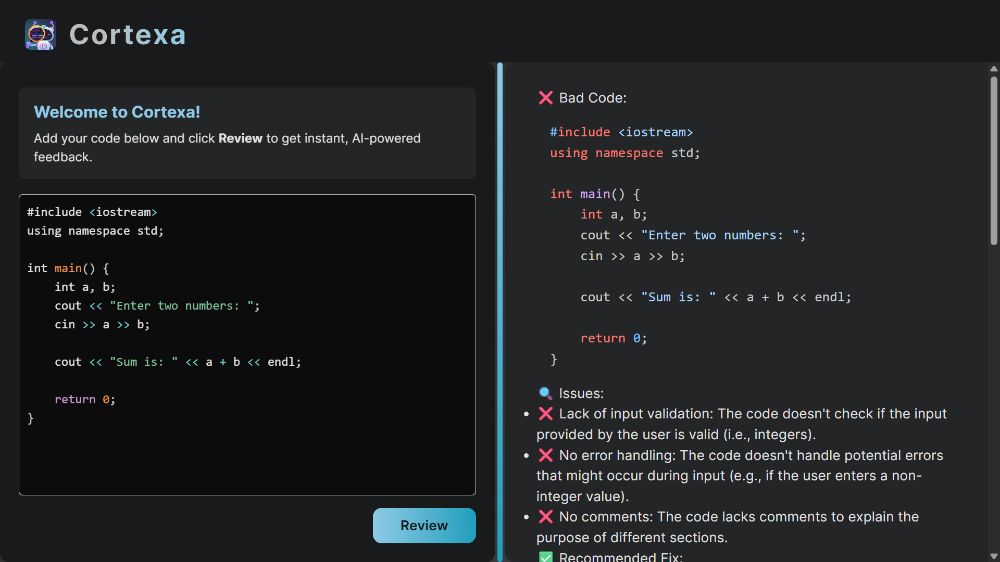
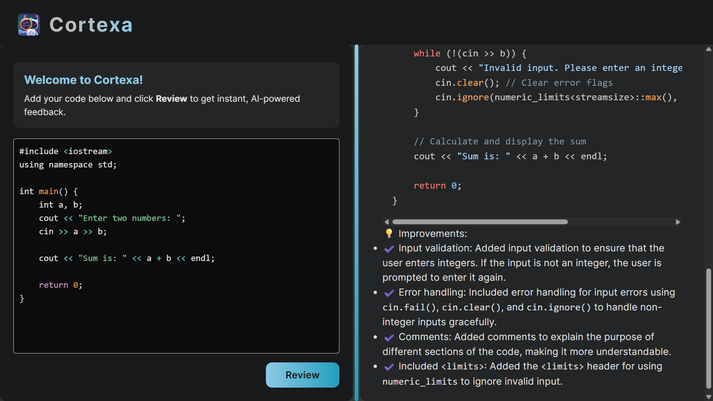

# 🤖✨ Welcome to **Cortexa** – Your AI Code Review Buddy! ✨

Cortexa is your smart, friendly, and lightning-fast AI-powered code reviewer!  
Paste your code, hit **Review**, and get instant, expert feedback powered by Google Gemini.  
Perfect for learners, pros, and everyone in between – all in a beautiful, interactive interface.

---

## 🚀 Features You'll Love

- 🤖 **AI-Powered Reviews:** Get smart, constructive feedback using Google Gemini.
- 🎨 **Modern UI:** Sleek, resizable split view with gorgeous syntax highlighting.
- ⚡ **Instant Results:** Paste your code and see suggestions in seconds.
- 🖱️ **Resizable Panels:** Adjust the layout to your liking.
- 🌙 **Dark Mode:** Eye-friendly design for long coding sessions.

---

## 🛠️ Quick Start

### 1. Clone this repo

```sh
git clone https://github.com/your-username/cortexa.git
cd cortexa
```

### 2. Set up the backend

```sh
cd backend
npm install
```

- Create a `.env` file in the `backend/` folder and add your [Google Gemini API key](https://aistudio.google.com/app/apikey):

  ```
  GOOGLE_GEMINI_KEY=your-gemini-api-key-here
  ```

- Start the backend server:
  ```sh
  npx nodemon server.js
  ```

### 3. Set up the frontend

```sh
cd ../frontend
npm install
npm run dev
```

- Open [http://localhost:5173](http://localhost:5173) in your browser.

---

## 🔑 Gemini API Key

You need a Google Gemini API key for AI-powered reviews.  
Get yours from [Google AI Studio](https://aistudio.google.com/app/apikey) and add it to your backend `.env` file as shown above.

---

## 🖼️ Demo Screenshots

| 🔍 Review Example |
|-------------------|
|  |

| 🏠 Home Page |
|-------------|
|  |

---

## 💡 Tips

- Make sure your Gemini API key has access to the Gemini Pro model.
- The backend runs on port `3000` by default; the frontend runs on `5173`.
- For best results, use modern browsers like Chrome or Edge.

---

## 🤗 Thank You for Visiting Cortexa!

I am thrilled to have you here! If you have feedback or ideas, feel free to open an issue or contribute.  
Happy coding, and remember: **with Cortexa, you're never coding alone!** 🚀🤝✨
